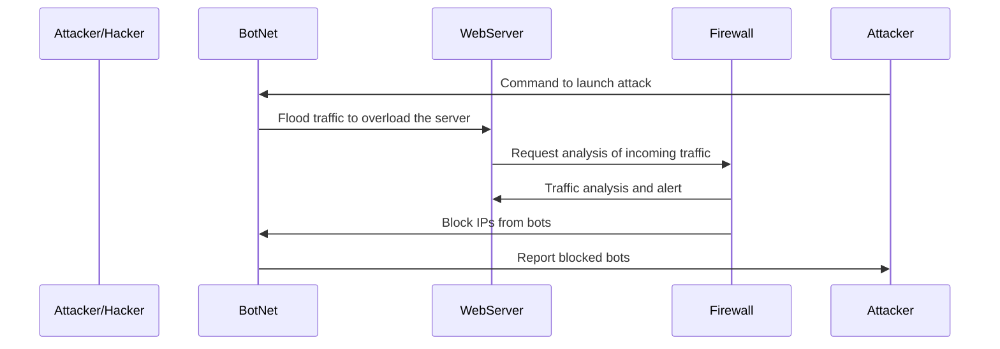

# ppthite.github.io
# Parth Thite ppthite@my.waketech.edu
# My Github account is brand new and is for school
# This is a repository I created for any future projects
# I clicked the clone button on the original respoistory I made

# About Me:
## My Interests
- I like playing Basketball and Football
- I draw and paint sometimes during the weekends
## Websites I Recommend
- [Google](https://www.wikipedia.com) - Its the best source for general knowledge
about basically any topic
- [WakeID](https://myapps.classlink.com/home) - This is where I access all the stuff for my highschool
classes so its indespensible for me right now

# DDoS Attack Sequence Diagram

# Documentation:

## In this diagram on DDOS attacks:

- The **attacker** starts the attack by controlling the botnet.
- The **botnet** then overwhelms the web server by sending massive amounts of traffic to the server.
- The **web server** requests a traffic analysis from the firewall to help manage the load that the botnet is sending.
- The **firewall** inspects the traffic, identifies malicious traffic, and blocks the botnet's IPs to mitigate the attack.

- <!DOCTYPE html>
<html lang="en">
<head>
    <meta charset="UTF-8">
    <meta name="viewport" content="width=device-width, initial-scale=1.0">
    <title>My Personal Introduction</title>
    
</head>
<body>
    <h1>My name is [Your Name]</h1>
    
I am a web development enthusiast with a passion for learning new technologies.

    
I enjoy solving problems, building websites, and continuously improving my coding skills.

    
In my free time, I love reading, exploring new places, and experimenting with different programming languages.

</body>
</html>
